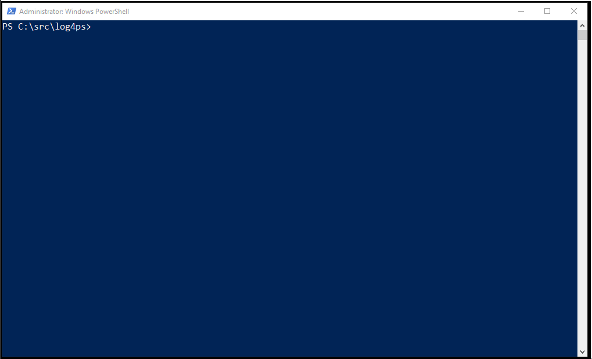

# Log4Ps

__PowerShell logging module__ leveraging log4net and support XML configuration.
This has been inspired by [log4posh](https://log4posh.codeplex.com/).


## Compatibility

| Version | Status |
----------|--------|
| WMF 4 | [](https://ci.appveyor.com/project/gaelcolas/log4ps-jhjl2) |
| WMF 5 |  [](https://ci.appveyor.com/project/gaelcolas/log4ps) |

## Dependencies

This module has no external dependencies, everything should be found under this github project.

### lib.common
The github project use a submodule (gaelcolas\lib.common) for some helper functions.
Should you clone this project, please note that log4ps\lib\lib.common is subproject, and you may need to do the following from times to times:

```git
cd log4ps\lib\lib.common
git submodule update --recursive
```
### lognet
The [log4net library binaries](https://logging.apache.org/log4net/download_log4net.cgi) (version 1.2.13) are unpacked in the lib folder for now to avoid the need for futher download, and to work in most environment out-of-the box.
In future, I might simply load from the GAL, and if not found, use PowerShell Package Manager to download from Chocolatey repository. 
I am not keen on doing so, but I'd like to remove the trouble of managing the log4net library, the hard coding of the version, and its updates.
Feeback welcome on how you'd like to see this bit managed.

## What does it do and How?

This PowerShell module allows you to effortlessly leverage the [Log4net library](https://logging.apache.org/log4net/) from your PowerShell modules or script to add consitent and detailed logging.

The module intercepts the Write-Verbose, Write-Error, Write-Warning, Write-Debug and Write-Host commandlet by use of proxy functions to first send it to the custom Write-log4pslog command before sending to their original commands from the Microsoft.PowerShell.Utility module.

The Write-Log4psLog will send the given message to the log4net logger, which needs to be configured prior using. The default behaviour is to simply output the messages sent to those command back into the console.
The easiest way to configure log4net, is to have an xml configuration file at the same location of your script, named the same as the PowerShell file with .config at the end (for file1.ps1, add the xml file1.ps1.config). This xml file must be valid xml and have a log4net section as per detailed on the [log4net configuration](https://logging.apache.org/log4net/release/manual/configuration.html).
See below for a practical example.

## Example
__demo6.ps1__
```powershell
#This file is to demo different type of appender
#remember, by default the module is looking for a config file, here .\demo6.ps1.config
Import-Module -Force $PSScriptRoot\..\..\log4ps

Write-Host 'This test is killing puppies'
Write-Verbose 'This is a verbose msg'
Write-Debug -Message 'Debug message'
Write-warning 'This is a WARN msg!'
Write-Error 'This is an error'

Get-Content $env:TMP\example.log

#find other example of file appender here: https://logging.apache.org/log4net/release/config-examples.html
```

__demo6.ps1.config__
```xml
<?xml version="1.0" encoding="utf-8" ?>
<configuration>
    <configSections>
        <section name="log4net" type="System.Configuration.IgnoreSectionHandler" />
    </configSections>
    <log4net>
        <appender name="RollingFile" type="log4net.Appender.RollingFileAppender">
            <file value="${TMP}\example.log" />
            <appendToFile value="true" />
            <maximumFileSize value="1KB" />
            <maxSizeRollBackups value="2" />
            <layout type="log4net.Layout.PatternLayout">
                <conversionPattern value="%date{yyyy-MM-dd HH:mm:ss.fff[zzz]} %logger [Line: %property{ScriptLineNumber}] %-5level - %message (%property{PSCallStack})%newline" />
            </layout>
        </appender>
        <root>
         <level value="DEBUG" />
         <appender-ref ref="RollingFile" />
        </root>
    </log4net>
</configuration>
```
Result:


## Configuration

## Appenders

## Layout

## Features
